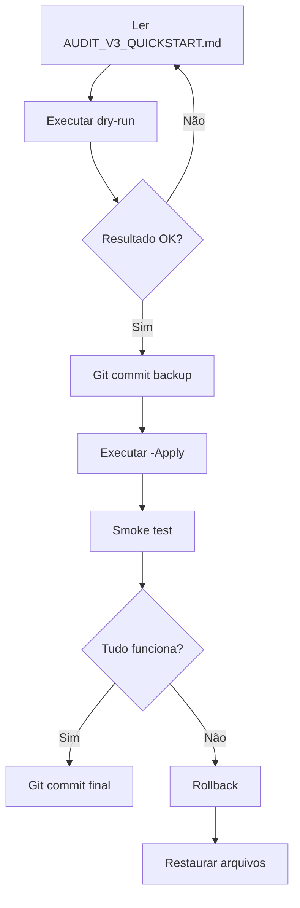

# 📚 Índice de Documentação - Auditoria V3

Este arquivo indexa toda a documentação gerada durante a **Auditoria V3** do projeto RC-Gestor.

---

## 🎯 Quick Start

**Para começar rápido:**
- **Leia primeiro:** [`AUDIT_V3_QUICKSTART.md`](./AUDIT_V3_QUICKSTART.md)
- **Execute dry-run:** `.\ajuda\cleanup_v3.ps1`
- **Documentação completa:** Veja "Arquivos Principais" abaixo

---

## 📁 Arquivos Principais

### Documentação de Análise

| Arquivo | Tamanho | Descrição | Uso |
|---------|---------|-----------|-----|
| [`AUDIT_V3_QUICKSTART.md`](./AUDIT_V3_QUICKSTART.md) | ~3 KB | **Guia rápido** de execução | ⭐ **Comece aqui** |
| [`AUDIT_V3_SUMMARY.md`](./AUDIT_V3_SUMMARY.md) | ~5 KB | Resumo executivo completo | Visão geral |
| [`CLEANUP_V3_ACTION_PLAN.md`](./CLEANUP_V3_ACTION_PLAN.md) | ~12 KB | Plano de ação detalhado | Referência técnica |
| [`CLEANUP_PLAN.md`](./CLEANUP_PLAN.md) | ~9 KB | Relatório de auditoria humanizado | Análise de dados |
| [`CLEANUP_PLAN.json`](./CLEANUP_PLAN.json) | ~28 KB | Dados estruturados (JSON) | Processamento programático |

### Dados Brutos

| Arquivo | Tamanho | Descrição | Uso |
|---------|---------|-----------|-----|
| [`ARVORE.txt`](./ARVORE.txt) | ~166 KB | Estrutura completa do projeto (ASCII) | Navegação visual |
| [`INVENTARIO.csv`](./INVENTARIO.csv) | ~23 KB | Inventário detalhado de todos os arquivos | Análise planilha |

### Scripts Automatizados

| Arquivo | Tamanho | Descrição | Uso |
|---------|---------|-----------|-----|
| [`cleanup_v3.ps1`](./cleanup_v3.ps1) | ~7 KB | Script de limpeza automatizado | **Executar ações** |

---

## 🔍 Navegação por Objetivo

### "Quero entender rapidamente o que foi feito"
1. Leia [`AUDIT_V3_QUICKSTART.md`](./AUDIT_V3_QUICKSTART.md) (3 min)
2. Execute dry-run: `.\ajuda\cleanup_v3.ps1` (30 seg)

### "Quero ver todos os detalhes técnicos"
1. Leia [`AUDIT_V3_SUMMARY.md`](./AUDIT_V3_SUMMARY.md) (10 min)
2. Leia [`CLEANUP_V3_ACTION_PLAN.md`](./CLEANUP_V3_ACTION_PLAN.md) (15 min)
3. Analise [`CLEANUP_PLAN.json`](./CLEANUP_PLAN.json) programaticamente

### "Quero executar a limpeza"
1. Leia [`AUDIT_V3_QUICKSTART.md`](./AUDIT_V3_QUICKSTART.md) (seção "Como Executar")
2. Execute: `.\ajuda\cleanup_v3.ps1` (dry-run)
3. Se OK: `.\ajuda\cleanup_v3.ps1 -Apply` (aplicar)
4. Valide: `python .\scripts\smoke_runtime.py`

### "Quero analisar a estrutura do projeto"
1. Abra [`ARVORE.txt`](./ARVORE.txt) (visualização ASCII)
2. Abra [`INVENTARIO.csv`](./INVENTARIO.csv) (análise Excel/planilha)

---

## 📊 Resumo das Descobertas

### ✅ Pontos Fortes
- **0 arquivos obsoletos** (todos <60 dias)
- **0 CVEs** de segurança
- **163 arquivos** bem organizados
- **95 arquivos runtime** testados (100% OK)

### 🟡 Oportunidades
- **1 duplicata real:** `assets/app.ico` = `rc.ico` (122 KB)
- **1 asset não usado:** `rc.png` (32 KB, comentado no código)
- **1 backup vazio:** `infrastructure_scripts_init.py.bak` (0 KB)

### 💰 Economia Potencial
- **~154 KB** total (impacto mínimo)
- **-1.8%** arquivos (163 → 160)
- **-6.2%** tamanho repo (~2.5 MB → ~2.35 MB)

---

## 🚀 Fluxo de Execução Recomendado



---

## 🛠️ Ferramentas Relacionadas

### Scripts de Auditoria
- `scripts/audit_repo_v2.py` → Gerador de relatórios (SHA-256, duplicatas, stale)
- `scripts/smoke_runtime.py` → Validador de runtime (imports, deps, healthcheck)

### Scripts de Limpeza
- `ajuda/cleanup_v3.ps1` → **Limpeza automatizada V3** (este processo)

### Scripts de Análise de Dependências (v1.0.29-v1.0.32)
- `scripts/test_minimal_deps.ps1` → Testador de dependências mínimas
- Veja [`DEPS-QUICKSTART.md`](./DEPS-QUICKSTART.md) para mais detalhes

---

## 📈 Histórico de Auditorias

| Versão | Data | Foco | Resultado |
|--------|------|------|-----------|
| **V3** | 2025-01-18 | Comprehensive re-audit | ✅ 163 arquivos, 0 stale, 1 duplicata |
| V2 | 2025-01-17 | First SHA-256 audit | ✅ 163 arquivos, 2 grupos duplicados |
| V1 | 2025-01-16 | Initial scan | ✅ Estrutura documentada |

---

## ⚠️ Avisos Importantes

### 🔴 NÃO REMOVER NUNCA
- `rc.ico` (raiz) → Usado em 8+ locais
- Arquivos em `runtime/` → Essencial para execução
- `build/rc_gestor.spec` → Necessário para builds

### 🟢 SEGURO PARA MOVER/REMOVER
- `assets/app.ico` → Duplicado confirmado (SHA-256)
- `rc.png` → Comentado no código, não usado
- `*.bak` vazios → Backups sem conteúdo

---

## 📞 Referência Rápida

### Comandos Úteis

```powershell
# Dry-run (sem alterações)
.\ajuda\cleanup_v3.ps1

# Aplicar limpeza
.\ajuda\cleanup_v3.ps1 -Apply

# Smoke test
python .\scripts\smoke_runtime.py

# Restaurar arquivo
Move-Item ajuda\_quarentena_assets\app.ico assets\ -Force
Move-Item ajuda\_quarentena_assets\rc.png . -Force

# Rollback completo
git reset --hard HEAD~1
```

### Arquivos de Log

Durante a execução, o script gera logs visuais no terminal. Não há logs em arquivo.

---

## ✅ Checklist de Conclusão

Ao concluir a auditoria V3, verifique:

- [x] **ARVORE.txt** regenerado
- [x] **INVENTARIO.csv** regenerado
- [x] **audit_repo_v2.py** executado
- [x] **Referências verificadas** (rc.ico, rc.png)
- [x] **Plano de ação criado** (CLEANUP_V3_ACTION_PLAN.md)
- [x] **Script automatizado criado** (cleanup_v3.ps1)
- [x] **Dry-run testado** (sucesso)
- [x] **Documentação completa** (7 arquivos gerados)
- [ ] **Limpeza aplicada** (pendente - decisão do usuário)
- [ ] **Smoke test pós-limpeza** (pendente)
- [ ] **Commit final** (pendente)

---

## 📝 Metadados

- **Gerado em:** 2025-01-18 07:42:00
- **Branch:** integrate/v1.0.29
- **Python:** 3.13.7
- **PowerShell:** 5.1
- **Responsável:** Auditoria V3 completa
- **Ferramenta:** audit_repo_v2.py + análise manual

---

**Este índice serve como ponto de entrada para toda a documentação da Auditoria V3.**  
**Para começar, leia [`AUDIT_V3_QUICKSTART.md`](./AUDIT_V3_QUICKSTART.md).**
