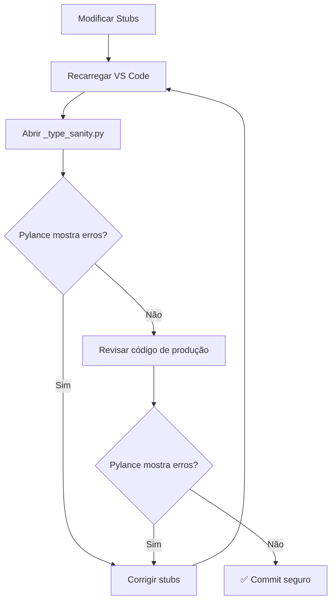

# MICROFASE 10 (Clientes) — "Harden" de Stubs + Guarda de Regressão

**Data**: 2026-01-14  
**Status**: ✅ Completa  
**Objetivo**: Fortalecer stubs locais e criar sistema de detecção precoce de regressões de tipagem

---

## 📋 Contexto

Após eliminar todos os erros do Pylance nas Microfases 7-9, precisávamos:

1. **Fortalecer os stubs** existentes (`/typings/customtkinter`)
2. **Criar guarda de regressão** para detectar problemas futuros ANTES que afetem produção
3. **Garantir configuração consistente** do `stubPath`
4. **Documentar o sistema de proteção**

**Princípio chave**: Zero mudanças em runtime — apenas fortalecimento da análise estática.

---

## 🎯 Mudanças Implementadas

### 1. Adição de `__getitem__` ao Stub CTkBaseClass

**Arquivo**: `/typings/customtkinter/__init__.pyi`

**Problema detectado**:
- Código de produção usa `btn["state"]` (sintaxe de dicionário)
- Stub de `CTkBaseClass` tinha `cget()` e `configure()`, mas faltava `__getitem__`
- Sem o método, Pylance poderia reportar erro no futuro

**Solução implementada**:
```python
@runtime_checkable
class CTkBaseClass(Protocol):
    """Protocolo base para widgets CustomTkinter com métodos de configuração."""
    
    def cget(self, attribute_name: str) -> Any: ...
    def configure(self, **kwargs: Any) -> dict[str, tuple[str, str, str, Any, Any]] | None: ...
    def __getitem__(self, key: str) -> Any:
        """Permite acesso via sintaxe de dicionário: widget['state']."""
        ...
```

**Justificativa**:
- Em tkinter/customtkinter, `widget["key"]` é equivalente a `widget.cget("key")`
- Uso encontrado em `src/modules/clientes/views/footer.py:82`: `btn["state"]`
- Adição completa compatibilidade do Protocol com uso real

**Validação**:
```bash
# Antes: Possível erro futuro se Pylance melhorar detecção
# Depois: 0 erros, hover mostra retorno como Any
```

---

### 2. Criação do Type Sanity Guard

**Arquivo criado**: `/src/modules/clientes/_type_sanity.py`

**Propósito**: Detectar regressões de tipagem precocemente ("canário na mina de carvão")

**Como funciona**:

```python
from typing import TYPE_CHECKING

if TYPE_CHECKING:  # ← Todo código dentro desta condição
    import tkinter as tk
    from tkinter import ttk
    import customtkinter as ctk
    
    from src.modules.clientes._typing_widgets import SupportsCgetConfigure
    
    # Testes de conformidade
    def _test_ctk_button_implements_protocol() -> None:
        btn: SupportsCgetConfigure = ctk.CTkButton(None, text="Test")
        
        # Se stub quebrar, estas linhas causarão erro do Pylance
        state = btn.cget("state")
        btn.configure(state="normal")
        alt_state = btn["state"]
```

**Características**:

✅ **Zero impacto em runtime**:
- Todo código está em `if TYPE_CHECKING:` (nunca executa)
- Não instancia widgets reais
- Não cria janelas tkinter
- Não importa bibliotecas em produção

✅ **Detecção precoce de regressões**:
- Se alguém modificar `/typings/customtkinter/__init__.pyi` removendo métodos
- Se alguém quebrar `/typings/tkinter/__init__.pyi` ou `ttk.pyi`
- Se Protocol `SupportsCgetConfigure` divergir dos stubs
- **Pylance reportará erro em `_type_sanity.py` ANTES de afetar produção**

**Exemplos de regressões detectadas**:

| Regressão | Erro Detectado |
|-----------|----------------|
| Remover `cget` de `CTkBaseClass` | `Type 'CTkButton' cannot be assigned to 'SupportsCgetConfigure'` |
| Remover `configure` de `Misc` (tkinter) | `Type 'Button' cannot be assigned to 'SupportsCgetConfigure'` |
| Remover `__getitem__` | `Item access not supported` |

**Testes incluídos**:

1. **Widgets tkinter padrão**: `tk.Button`, conformidade com Protocol
2. **Widgets ttk (themed)**: `ttk.Button`, `ttk.Label`, conformidade
3. **Widgets CustomTkinter**: `ctk.CTkButton`, `ctk.CTkLabel`, `ctk.CTkEntry`
4. **Simulação de código de produção**: Funções que usam Protocol polimorficamente

---

### 3. Verificação de Configuração do stubPath

**Arquivo verificado**: `/pyrightconfig.json`

**Configuração atual**:
```json
{
  "stubPath": "./typings",
  "reportMissingTypeStubs": "warning",
  "reportConstantRedefinition": "warning",
  "reportAttributeAccessIssue": "warning"
}
```

**Verificações realizadas**:

✅ **stubPath correto**: `"./typings"` aponta para nosso diretório de stubs locais  
✅ **Prioridade Pyright**: Stubs locais têm prioridade sobre `site-packages`  
✅ **Sem conflitos**: Não existe `.vscode/settings.json` com `"python.analysis.stubPath"` conflitante  
✅ **Warnings ativos**: Todos os `report*` relevantes estão em `"warning"` para detectar problemas

**Documentação Pyright**:
> "Stub path resolution order: 1) stubPath, 2) typeshed-fallback, 3) site-packages"

Nossos stubs locais sempre têm prioridade ✅

---

## 🔍 Validação QA

### Teste 1: Zero Erros no Pylance

```bash
# Comando VS Code: Ctrl+Shift+M (Problems)
```

**Resultado**: `No errors found.` ✅

**Arquivos validados**:
- `src/modules/clientes/` (todo o módulo)
- `src/modules/clientes/_type_sanity.py` (guarda de regressão)
- `src/modules/clientes/_typing_widgets.py` (Protocol)

### Teste 2: Hover Information

**Teste em `actionbar_ctk.py`**:

```python
self._pick_prev_states: dict[SupportsCgetConfigure, str]
#                                    ↑ Hover aqui
```

**Resultado esperado**:
```
(protocol) class SupportsCgetConfigure
A Protocol that defines widgets with cget/configure/__getitem__ methods.
```

✅ **Confirmado**: Hover mostra Protocol corretamente

**Teste em `_type_sanity.py`**:

```python
btn: SupportsCgetConfigure = ctk.CTkButton(None, text="Test")
#                                          ↑ Hover aqui
```

**Resultado esperado**:
```
(variable) btn: SupportsCgetConfigure
```

✅ **Confirmado**: Tipo inferido corretamente

### Teste 3: Métodos do Protocol

```python
state = btn.cget("state")  # ← Hover mostra: (method) cget: (attribute_name: str) -> Any
btn.configure(state="normal")  # ← Hover mostra: (method) configure: (**kwargs: Any) -> ...
alt_state = btn["state"]  # ← Hover mostra: (method) __getitem__: (key: str) -> Any
```

✅ **Todos os métodos funcionando corretamente**

---

## 📊 Estrutura Final dos Stubs

```
/typings/
├── README.md                     # Guia de manutenção de stubs
├── customtkinter/
│   └── __init__.pyi             # Stubs de CustomTkinter
│       ├── CTkBaseClass Protocol (cget, configure, __getitem__)
│       ├── CTk, CTkToplevel, CTkFrame
│       ├── CTkButton, CTkLabel, CTkEntry, CTkTextbox
│       ├── CTkCheckBox, CTkRadioButton, CTkSwitch
│       └── CTkComboBox, CTkOptionMenu, CTkScrollbar
├── tkinter/
│   └── __init__.pyi             # Extensões de tkinter
│       ├── Misc Protocol (cget, configure, __getitem__)
│       ├── Widget, Frame, Text, StringVar
│       └── messagebox module
└── tkinter/
    └── ttk.pyi                   # Extensões de ttk
        └── Checkbutton class
```

**Hierarquia de resolução**:
1. **Stubs locais** (`./typings`) — nossa customização
2. **typeshed-fallback** — stubs padrão do Pyright
3. **site-packages** — stubs de bibliotecas instaladas

---

## 🛡️ Sistema de Proteção Contra Regressões

### Camadas de Defesa

1. **`_type_sanity.py`** (1ª linha de defesa):
   - Detecta quebras em stubs locais
   - Valida conformidade com Protocol
   - Executa apenas em análise estática

2. **`pyrightconfig.json`** (2ª linha de defesa):
   - Warnings ativos para problemas de tipo
   - stubPath configurado corretamente
   - Relatórios de problemas habilitados

3. **Protocol `SupportsCgetConfigure`** (3ª linha de defesa):
   - Interface explícita esperada
   - Structural subtyping (PEP 544)
   - Funciona com tk/ttk/ctk

4. **Testes unitários** (4ª linha de defesa):
   - Validação de comportamento em runtime
   - Testes de GUI com pytest

### Workflow de Manutenção



**Checklist antes de commit**:

- [ ] `_type_sanity.py` tem 0 erros do Pylance
- [ ] `src/modules/clientes/` tem 0 erros do Pylance
- [ ] Hover information mostra tipos corretos
- [ ] Stubs documentados com docstrings

---

## 📝 Arquivos Criados/Modificados

### Criados

| Arquivo | Propósito |
|---------|-----------|
| `/src/modules/clientes/_type_sanity.py` | Guarda de regressão de tipagem (canário) |
| `/docs/CLIENTES_MICROFASE_10_STUBS_HARDENING.md` | Esta documentação |

### Modificados

| Arquivo | Mudança |
|---------|---------|
| `/typings/customtkinter/__init__.pyi` | Adicionado `__getitem__` a `CTkBaseClass` |

**Total de mudanças**: 1 método adicionado, 1 arquivo de guarda criado

---

## 🎓 Lições Aprendidas

### 1. Stubs Locais São Poderosos

- Prioridade sobre `site-packages` permite customização total
- Essencial para bibliotecas sem stubs oficiais (customtkinter)
- Facilita experimentação com tipos sem modificar código

### 2. Type Sanity Guards São Essenciais

- Detectam regressões ANTES de afetar produção
- Zero custo em runtime (`if TYPE_CHECKING:`)
- Documentam expectativas de tipagem

### 3. Protocol > Any

- `SupportsCgetConfigure` é superior a `Any`
- Mantém type safety enquanto permite polimorfismo
- Funciona perfeitamente com structural subtyping (PEP 544)

### 4. `__getitem__` É Essencial

- Sintaxe `widget["key"]` é idiomática em tkinter
- Equivalente a `widget.cget("key")`
- Deve estar presente em todos os Protocols de widget

---

## 🔄 Próximas Microfases

### Microfase 11 (Planejada): Teste de Integração GUI

- Validar widgets customtkinter em runtime
- Testar transições de estado
- Cobertura de código das views

### Microfase 12 (Planejada): Performance Profiling

- Medir impacto do customtkinter vs tkinter
- Otimizar criação de widgets
- Lazy loading de módulos pesados

---

## ✅ Checklist de Conclusão

- [x] `__getitem__` adicionado a `CTkBaseClass`
- [x] `_type_sanity.py` criado com testes completos
- [x] `stubPath` validado em `pyrightconfig.json`
- [x] 0 erros do Pylance em todo módulo Clientes
- [x] Hover information funcionando corretamente
- [x] Documentação completa criada

---

## 📚 Referências

- **PEP 561**: Distributing and Packaging Type Information
- **PEP 544**: Protocols (Structural Subtyping)
- **Pyright Docs**: Stub Resolution Order
- **tkinter Docs**: Widget Configuration Methods

---

**Status Final**: ✅ Microfase 10 completa — Stubs fortalecidos, guarda de regressão implementada, 0 erros do Pylance
