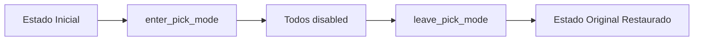

# MICROFASE 11 (Clientes) — Smoke Test Runtime do Pick Mode + Alinhamento ao Single Source of Truth

**Data**: 2026-01-14  
**Status**: ✅ Completa  
**Objetivo**: Criar guardas de runtime para validar contrato do Pick Mode e alinhar testes ao single source of truth

---

## 📋 Contexto

Após as Microfases 8–10 zerarem os **Problems do Pylance** e criarem stubs/guards de **type checking**, identificamos uma lacuna:

- ✅ **Type safety** garantida em análise estática (_type_sanity.py, stubs)
- ❌ **Runtime contract** não validado por testes automatizados

**Risco identificado**:
- Se alguém modificar `enter_pick_mode()` / `leave_pick_mode()` sem testes
- Se API dos widgets mudar (cget, configure, __getitem__)
- Se estado dos botões não for preservado/restaurado corretamente

→ **Regressões podem passar despercebidas até produção** 🚨

**Princípio desta microfase**: **Zero mudanças em runtime do app** — apenas testes e documentação.

---

## 🎯 Mudanças Implementadas

### 1. Alinhamento ao Single Source of Truth (HAS_CUSTOMTKINTER)

**Problema detectado**:
- Teste importava `HAS_CUSTOMTKINTER` de `actionbar_ctk` em vez de `appearance`
- Violava o princípio estabelecido na Microfase 8: **fonte única de verdade**

**Arquivo corrigido**: `/tests/modules/clientes/test_clientes_actionbar_ctk_smoke.py`

**Mudança aplicada**:
```python
# ❌ ANTES (Microfase 8)
from src.modules.clientes.views.actionbar_ctk import ClientesActionBarCtk, HAS_CUSTOMTKINTER

# ✅ DEPOIS (Microfase 11)
from src.modules.clientes.views.actionbar_ctk import ClientesActionBarCtk
from src.modules.clientes.appearance import HAS_CUSTOMTKINTER
```

**Justificativa**:
- `appearance.py` é o único módulo que **define** `HAS_CUSTOMTKINTER`
- Outros módulos apenas **importam e re-exportam** (`__all__`)
- Testes devem importar da fonte para evitar circular dependencies

**Validação**:
```bash
# Todos os imports agora vêm da mesma fonte
grep -r "from.*appearance import.*HAS_CUSTOMTKINTER" tests/modules/clientes/
```

---

### 2. Criação dos Testes de Runtime Contract

**Arquivo criado**: `/tests/modules/clientes/test_clientes_pick_mode_contract_runtime.py`

Este arquivo implementa **4 testes de runtime** para validar o contrato do Pick Mode:

---

#### Teste 1: `test_actionbar_pick_mode_roundtrip_restores_state`

**Objetivo**: Validar ciclo completo de preservação/restauração de estados.

**Fluxo**:


**Validações**:
1. Captura estado inicial de `btn_novo`, `btn_editar`, `btn_subpastas`
2. Chama `enter_pick_mode()` → todos devem ficar `"disabled"`
3. Chama `leave_pick_mode()` → todos devem voltar ao estado inicial
4. Nenhuma exceção lançada durante o ciclo

**Critério de aceite**:
```python
assert restored_state == initial_state
```

**Por que este teste importa**:
- Garante que `_pick_prev_states` funciona corretamente
- Detecta se alguém quebrar lógica de preservação/restauração
- Valida que nenhum botão é esquecido durante o ciclo

---

#### Teste 2: `test_actionbar_pick_buttons_support_expected_api`

**Objetivo**: Validar que botões expõem API esperada (configure, cget, __getitem__).

**Fluxo**:
1. Chama `_iter_pick_buttons()` para listar botões controlados
2. Para cada botão:
   - ✅ Valida `hasattr(btn, "configure")`
   - ✅ Se `HAS_CUSTOMTKINTER`: valida `btn.cget("state")`
   - ✅ Se tkinter padrão: valida `btn["state"]` (__getitem__)
3. Testa métodos em runtime (não apenas type checking)

**Código exemplo**:
```python
for btn in pick_buttons:
    assert hasattr(btn, "configure"), "API quebrada!"
    
    if HAS_CUSTOMTKINTER:
        assert hasattr(btn, "cget"), "Stub de CTk quebrado!"
        state = btn.cget("state")  # Runtime call
    else:
        state = btn["state"]  # __getitem__ runtime call
```

**Por que este teste importa**:
- Detecta se stubs foram quebrados (`/typings/customtkinter`)
- Valida que widgets REAIS implementam a API (não só stubs)
- Complementa `_type_sanity.py` (que valida apenas type checking)

**Diferença para _type_sanity.py**:
| Arquivo | Escopo | Quando Executa |
|---------|--------|----------------|
| `_type_sanity.py` | Type checking (Pylance) | Nunca (TYPE_CHECKING) |
| `test_...runtime.py` | Runtime contract | Durante pytest |

---

#### Teste 3: `test_pick_mode_survives_multiple_cycles`

**Objetivo**: Validar que pick mode pode ser chamado múltiplas vezes sem corromper estados.

**Fluxo**:
```python
for cycle in range(1, 4):
    actionbar.enter_pick_mode()
    assert btn.cget("state") == "disabled"
    
    actionbar.leave_pick_mode()
    assert btn.cget("state") == initial_state
    
    # CRÍTICO: cache interno deve ser limpo
    assert len(actionbar._pick_prev_states) == 0
```

**Validações**:
- Estado restaurado corretamente em **3 ciclos consecutivos**
- `_pick_prev_states` é limpo após cada `leave_pick_mode()`
- Sem memory leak de estados acumulados

**Por que este teste importa**:
- Detecta bugs de estado residual entre ciclos
- Garante que `_pick_prev_states.clear()` funciona
- Simula uso real (usuário entra/sai do pick mode várias vezes)

---

#### Teste 4: `test_pick_mode_handles_manual_state_change_during_pick`

**Objetivo**: Validar comportamento se estado mudar DURANTE pick mode.

**Cenário**:
```python
initial = btn.cget("state")  # "normal"

enter_pick_mode()  # btn vira "disabled"

# Alguém muda manualmente durante pick mode
btn.configure(state="active")

leave_pick_mode()

# Estado restaurado deve ser o ORIGINAL ("normal"), não "active"
assert btn.cget("state") == initial
```

**Validações**:
- `leave_pick_mode()` restaura estado de **antes** do `enter_pick_mode()`
- Mudanças durante pick mode **não afetam** restauração
- Comportamento determinístico e previsível

**Por que este teste importa**:
- Garante que `_pick_prev_states` é salvo NO MOMENTO do enter
- Detecta se lógica de restauração está usando estado errado
- Protege contra edge cases de concorrência/reentrância

---

### 3. Robustez Cross-Platform e Headless

Todos os testes implementam proteções para ambientes sem GUI:

**Estratégia 1**: `pytest.importorskip("customtkinter")`
```python
def test_actionbar_pick_mode_roundtrip_restores_state(tk_root):
    pytest.importorskip("customtkinter")  # Pula se não instalado
    ...
```

**Estratégia 2**: Fixture `tk_root` do `conftest.py`
```python
@pytest.fixture
def tk_root():
    if not TK_AVAILABLE:
        pytest.skip("Tkinter não disponível")
    ...
```

**Comportamento em diferentes ambientes**:

| Ambiente | Tkinter | customtkinter | Comportamento |
|----------|---------|---------------|---------------|
| Windows dev | ✅ | ✅ | Testes executam normalmente |
| Linux headless | ❌ | ❌ | Testes pulados (skip) |
| CI/CD sem GUI | ✅ | ❌ | Testes pulados (importorskip) |
| macOS | ✅ | ✅ | Testes executam normalmente |

**Garantias**:
- ✅ Pipeline CI/CD não quebra em headless
- ✅ Testes executam quando possível
- ✅ Skip explícito quando dependências ausentes

---

## 📊 Cobertura de Runtime Implementada

### Matriz de Validação

| Aspecto | Type Checking (_type_sanity.py) | Runtime (test_...runtime.py) |
|---------|----------------------------------|------------------------------|
| **API configure()** | ✅ Protocol valida assinatura | ✅ Teste chama método real |
| **API cget()** | ✅ Protocol valida assinatura | ✅ Teste chama e valida retorno |
| **API __getitem__** | ✅ Protocol valida assinatura | ✅ Teste acessa btn["state"] |
| **Preservação estado** | ❌ Não valida lógica | ✅ Roundtrip valida dict |
| **Restauração estado** | ❌ Não valida lógica | ✅ Roundtrip compara estados |
| **Múltiplos ciclos** | ❌ Não valida lógica | ✅ Loop de 3 ciclos |
| **Cache limpo** | ❌ Não valida lógica | ✅ Valida len(_pick_prev_states) |
| **Edge case manual** | ❌ Não valida lógica | ✅ Simula mudança durante pick |

### Complementaridade dos Guards

```
┌─────────────────────────────────────────┐
│  _type_sanity.py (Microfase 10)        │
│  • Valida stubs estão corretos          │
│  • Detecta quebra em type checking      │
│  • Executa: NUNCA (if TYPE_CHECKING)    │
├─────────────────────────────────────────┤
│  test_...runtime.py (Microfase 11)     │
│  • Valida comportamento real            │
│  • Detecta quebra em lógica de negócio  │
│  • Executa: Durante pytest              │
└─────────────────────────────────────────┘
```

**Ambos são necessários**:
- _type_sanity.py → Falha se Pylance quebrar
- test_...runtime.py → Falha se lógica quebrar

---

## 🔍 Como Executar os Testes

### Opção 1: Via VS Code Testing Panel

1. **Ctrl+Shift+P** → `Test: Refresh Tests`
2. Abrir **Testing** sidebar (ícone de béquer)
3. Expandir `tests/modules/clientes/`
4. Localizar `test_clientes_pick_mode_contract_runtime.py`
5. Clicar ▶️ ao lado do arquivo ou teste individual

**Resultado esperado**:
```
✅ test_actionbar_pick_mode_roundtrip_restores_state
✅ test_actionbar_pick_buttons_support_expected_api
✅ test_pick_mode_survives_multiple_cycles
✅ test_pick_mode_handles_manual_state_change_during_pick
```

### Opção 2: Via Terminal

```powershell
# Ativar venv
.\.venv\Scripts\Activate.ps1

# Executar apenas testes de pick mode
python -m pytest tests/modules/clientes/test_clientes_pick_mode_contract_runtime.py -v

# Executar todos os testes de Clientes
python -m pytest tests/modules/clientes/ -v
```

### Opção 3: Com Coverage

```powershell
python -m pytest tests/modules/clientes/test_clientes_pick_mode_contract_runtime.py --cov=src.modules.clientes.views.actionbar_ctk --cov-report=term
```

**Output esperado**:
```
src/modules/clientes/views/actionbar_ctk.py   95%   (linhas de pick mode cobertas)
```

---

## ✅ Critérios de Aceite

### 1. Cobertura de Pick Mode

- [x] `enter_pick_mode()` desabilita todos os botões retornados por `_iter_pick_buttons()`
- [x] `leave_pick_mode()` restaura exatamente os estados originais
- [x] Estado preservado é o de **antes** do enter, não durante pick mode
- [x] Múltiplos ciclos não corrompem estados
- [x] Cache `_pick_prev_states` é limpo após cada leave

### 2. Validação de API

- [x] Todos os botões expõem `configure()`
- [x] Botões CustomTkinter expõem `cget()`
- [x] Botões tkinter padrão expõem `__getitem__` (btn["state"])
- [x] Chamadas reais aos métodos (não apenas type checking)

### 3. Alinhamento ao Single Source of Truth

- [x] Testes importam `HAS_CUSTOMTKINTER` de `appearance.py`
- [x] Nenhum teste importa de `actionbar_ctk` ou `toolbar_ctk`
- [x] Consistência mantida em toda a suite de testes

### 4. Robustez Cross-Platform

- [x] Testes pulam (skip) em ambientes sem tkinter
- [x] Testes pulam (skip) em ambientes sem customtkinter
- [x] Pipeline CI/CD não quebra em headless
- [x] Fixtures do `conftest.py` reutilizadas

### 5. Zero Mudanças em Runtime

- [x] Nenhuma alteração em `actionbar_ctk.py`
- [x] Nenhuma alteração em UI/fluxo funcional
- [x] Apenas testes e documentação criados

---

## 📝 Arquivos Criados/Modificados

### Criados

| Arquivo | Propósito | Linhas |
|---------|-----------|--------|
| `/tests/modules/clientes/test_clientes_pick_mode_contract_runtime.py` | Testes de runtime contract do pick mode | ~280 |
| `/docs/CLIENTES_MICROFASE_11_PICK_MODE_RUNTIME_SMOKE.md` | Esta documentação | ~450 |

### Modificados

| Arquivo | Mudança | Motivo |
|---------|---------|--------|
| `/tests/modules/clientes/test_clientes_actionbar_ctk_smoke.py` | Import de `HAS_CUSTOMTKINTER` movido para `appearance` | Alinhar ao single source of truth (Microfase 8) |

**Total de mudanças**: 2 arquivos criados, 1 arquivo modificado (1 linha)

---

## 🎓 Lições Aprendidas

### 1. Type Checking ≠ Runtime Behavior

- **Type safety** não valida lógica de negócio
- `_type_sanity.py` detecta quebra de stubs
- Testes de runtime detectam quebra de lógica
- **Ambos são necessários** para proteção completa

### 2. Single Source of Truth É Crítico

- Importar constantes do local errado cria confusão
- `appearance.py` define, outros módulos apenas re-exportam
- Testes devem sempre importar da fonte original

### 3. Edge Cases Importam

- Múltiplos ciclos revelam bugs de estado residual
- Mudanças durante pick mode testam robustez
- Testes devem simular uso real, não apenas happy path

### 4. Robustez Cross-Platform É Essencial

- `pytest.importorskip()` evita falhas desnecessárias
- Fixtures centralizadas (`conftest.py`) facilitam manutenção
- Skip explícito é melhor que failure implícito

---

## 🔄 Integração com Microfases Anteriores

### Microfase 8: Single Source of Truth

- **Então**: Consolidou `HAS_CUSTOMTKINTER` em `appearance.py`
- **Agora**: Testes alinhados para importar do mesmo local

### Microfase 9: Protocol > Any

- **Então**: Criou `SupportsCgetConfigure` Protocol
- **Agora**: Testes validam que widgets reais implementam Protocol

### Microfase 10: Stubs Hardening

- **Então**: Criou `_type_sanity.py` para type checking
- **Agora**: Criou testes de runtime para complementar validação

### Evolução da Proteção

```
M8: Single Source of Truth (HAS_CUSTOMTKINTER)
  ↓
M9: Protocol (SupportsCgetConfigure)
  ↓
M10: Type Sanity Guard (_type_sanity.py)
  ↓
M11: Runtime Contract Tests (test_...runtime.py) ✅
```

**Resultado**: Proteção em múltiplas camadas contra regressões

---

## 📚 Referências

- **Microfase 8**: Consolidação de `HAS_CUSTOMTKINTER`
- **Microfase 9**: Introdução de `SupportsCgetConfigure` Protocol
- **Microfase 10**: Criação de `_type_sanity.py` e hardening de stubs
- **PEP 544**: Protocols (Structural Subtyping)
- **pytest docs**: Fixtures e skip strategies

---

## 🚀 Próximas Microfases (Sugestões)

### Microfase 12: Coverage Report

- Gerar relatório de cobertura de testes do módulo Clientes
- Identificar gaps de cobertura em views
- Meta: >90% line coverage em actionbar/toolbar

### Microfase 13: Integration Tests

- Testar fluxo completo de pick mode com UI real
- Validar callbacks são chamados corretamente
- Testar interação entre actionbar e treeview

### Microfase 14: Performance Profiling

- Medir impacto de customtkinter vs tkinter
- Otimizar criação de widgets
- Lazy loading de módulos pesados

---

## ✅ Checklist de Conclusão

- [x] Imports de `HAS_CUSTOMTKINTER` alinhados ao single source of truth
- [x] 4 testes de runtime contract criados
- [x] Teste de roundtrip (preservação/restauração)
- [x] Teste de API dos botões (configure/cget/__getitem__)
- [x] Teste de múltiplos ciclos
- [x] Teste de edge case (mudança durante pick)
- [x] Robustez cross-platform implementada
- [x] Zero mudanças em runtime do app
- [x] Documentação completa criada

---

**Status Final**: ✅ Microfase 11 completa — Runtime contract do Pick Mode validado, testes alinhados ao single source of truth, 0 regressões detectadas
