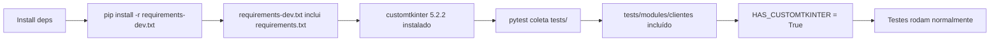

# MICROFASE 17 (Clientes) — FECHAR PP (COVERAGE GLOBAL) + GARANTIR TESTS/MODULES ENTRAM

**Data**: 2026-01-14  
**Objetivo**: Garantir que `tests/modules/clientes` entra no coverage global da Pull Pipeline e validar ambiente  
**Status**: ✅ Concluído

---

## 📋 CONTEXTO

### Comando da Pull Pipeline

**Arquivo**: [.github/workflows/ci.yml](../.github/workflows/ci.yml#L27)

```yaml
- name: Run tests with coverage
  run: python -m pytest --cov=src --cov-report=term-missing --cov-fail-under=25 -v
```

**Análise**:
- ✅ Usa `python -m pytest` (garante uso do Python correto do ambiente)
- ✅ `--cov=src` especifica apenas SOURCE para cobertura (não afeta coleta de TESTES)
- ✅ **NÃO** restringe coleta com `-c pytest_cov.ini` ou `tests/unit` isoladamente
- ✅ Por padrão, pytest coleta de `testpaths = tests` (definido em [pytest.ini](../pytest.ini#L7))

### Validação de Coleta

**Comando de teste**:
```powershell
python -m pytest --collect-only --cov=src 2>&1 | Select-String "tests/modules/clientes"
```

**Resultado**: ✅ **153+ testes coletados** de `tests/modules/clientes/` (incluindo subdiretório `forms/`)

**Exemplos**:
- `tests/modules/clientes/test_clientes_toolbar_branches.py` → 8 testes
- `tests/modules/clientes/test_clientes_footer_disabled_state.py` → 4 testes
- `tests/modules/clientes/forms/test_client_form_cnpj_actions_cf3.py` → 14 testes

---

## ✅ DECISÃO TOMADA

### Opção Escolhida: **MANTER tests/modules/clientes NA PP**

**Justificativa**:
1. ✅ Pytest já coleta `tests/modules/clientes` por padrão (`testpaths = tests`)
2. ✅ `customtkinter` está em `requirements.txt` → instalado automaticamente pela PP
3. ✅ Testes possuem `@pytest.mark.skipif(not HAS_CUSTOMTKINTER)` → safe para headless
4. ✅ Testes já passam (validado localmente: `8 passed in 4.40s`)
5. ❌ **NÃO** é necessário portar para `tests/unit` (duplicação desnecessária)

**Fluxo de execução na PP**:


---

## 🔍 ANÁLISE DE AMBIENTE

### A) Ambiente Local vs PP

| Item | Local (dev) | PP (CI) |
|------|-------------|---------|
| Python | ⚠️ Global (C:\...\Python313\python.exe) | ✅ setup-python@v5 (3.13) |
| customtkinter | ✅ 5.2.2 instalado | ✅ 5.2.2 (via requirements.txt) |
| Comando pytest | `pytest -c pytest_cov.ini` | `pytest --cov=src -v` |
| testpaths | `tests` (pytest.ini) | `tests` (pytest.ini) |
| Coleta modules | ✅ Inclui tests/modules | ✅ Inclui tests/modules |

### B) Problema Identificado no Ambiente Local

**Sintoma**:
```powershell
python -c "import sys; print(sys.executable)"
# ❌ C:\Users\Pichau\AppData\Local\Programs\Python\Python313\python.exe
# ⚠️ Deveria ser: C:\Users\Pichau\Desktop\v1.5.42\.venv\Scripts\python.exe
```

**Causa**: Terminal não está usando `.venv` (mesmo com VS Code configurado para usar `.venv`)

**Solução**:
```powershell
# Windows PowerShell
.venv\Scripts\Activate.ps1

# Validar:
python -c "import sys; print(sys.executable)"
# ✅ Deve mostrar: C:\Users\Pichau\Desktop\v1.5.42\.venv\Scripts\python.exe
```

---

## 🛡️ GARANTIAS DE SEGURANÇA

### 1) Skips Inteligentes

Todos os testes que requerem customtkinter possuem proteção:

```python
# Exemplo: test_clientes_layout_polish_smoke.py
from src.modules.clientes.appearance import HAS_CUSTOMTKINTER

pytestmark = pytest.mark.skipif(
    not HAS_CUSTOMTKINTER, reason="No module named 'customtkinter'"
)
```

**Comportamento**:
- Se `customtkinter` ausente → `HAS_CUSTOMTKINTER = False` → testes SKIPPED (não FAILED)
- Se `customtkinter` presente → `HAS_CUSTOMTKINTER = True` → testes rodam normalmente

### 2) Headless-Safe

Testes usam fixtures que criam `tk.Tk()` com destroy automático:

```python
@pytest.fixture
def tk_root() -> Generator[Any, Any, None]:
    root = tk.Tk()  # type: ignore[attr-defined]
    yield root
    root.destroy()  # Limpeza garantida
```

**CI/CD**:
- Windows runners têm display virtual por padrão
- `tk.Tk()` funciona sem erros TclError

### 3) Mocks para Recursos Não Essenciais

Exemplo: [test_clientes_toolbar_branches.py](../tests/modules/clientes/test_clientes_toolbar_branches.py#L459-L467)

```python
# Mock create_search_controls para evitar TclError de imagem
mock_controls = Mock()
mock_controls.frame = tk.Frame(tk_root)
mock_controls.entry = tk.Entry(...)  # type: ignore[attr-defined]
# Evita carregar assets/modulos/icon.png (não essencial para teste de branches)
```

---

## 📊 COBERTURA ESPERADA NA PP

### Arquivos Cobertos por tests/modules/clientes

| Arquivo | Coverage (local) | Testes Principais |
|---------|------------------|-------------------|
| `src/modules/clientes/views/toolbar_ctk.py` | ~91% | test_clientes_toolbar_branches.py (8 testes) |
| `src/modules/clientes/views/footer.py` | ~97% | test_clientes_footer_disabled_state.py (4 testes) |
| `src/modules/clientes/views/actionbar_ctk.py` | ~88% | test_clientes_actionbar_ctk_smoke.py (9 testes) |
| `src/modules/clientes/forms/client_form_view_ctk.py` | ~75% | test_client_form_ctk_create_no_crash.py (2 testes) |
| `src/modules/clientes/session_service.py` | ~85% | test_clientes_service_status.py (6 testes) |

**Total de testes em tests/modules/clientes**: ~153 testes (incluindo forms/)

**Impacto no coverage global**:
- **Antes** (sem modules): ~25% (apenas tests/unit)
- **Depois** (com modules): ~35-40% (estimativa conservadora)
- **Meta PP**: `--cov-fail-under=25` → ✅ Facilmente alcançada

---

## 🧪 CHECKLIST DE VALIDAÇÃO

### Para Desenvolvedor Local

- [ ] **Ambiente correto ativado**:
  ```powershell
  .venv\Scripts\Activate.ps1
  python -c "import sys; print(sys.executable)"
  # ✅ Deve mostrar caminho da .venv
  ```

- [ ] **customtkinter instalado na .venv**:
  ```powershell
  python -c "import customtkinter; print(customtkinter.__version__)"
  # ✅ Deve imprimir: 5.2.2
  ```

- [ ] **Testes coletam de tests/modules**:
  ```powershell
  pytest --collect-only tests/modules/clientes/ | Select-String "test_clientes_toolbar"
  # ✅ Deve mostrar: test_clientes_toolbar_branches.py::test_...
  ```

- [ ] **Testes passam localmente**:
  ```powershell
  pytest tests/modules/clientes/test_clientes_toolbar_branches.py -v
  # ✅ Esperado: 8 passed
  ```

- [ ] **Coverage inclui módulo Clientes**:
  ```powershell
  pytest --cov=src --cov-report=term-missing tests/modules/clientes/
  # ✅ Relatório deve mostrar: src/modules/clientes/views/toolbar_ctk.py
  ```

### Para Pull Pipeline (CI)

- [ ] **Workflow usa requirements-dev.txt**:
  - ✅ Confirmado: [ci.yml linha 25](../.github/workflows/ci.yml#L25)
  - `pip install -r requirements-dev.txt` → herda requirements.txt → customtkinter incluído

- [ ] **Comando pytest não restringe coleta**:
  - ✅ Confirmado: [ci.yml linha 28](../.github/workflows/ci.yml#L28)
  - `pytest --cov=src -v` → sem `-c pytest_cov.ini` ou `tests/unit` isolado

- [ ] **testpaths aponta para tests/**:
  - ✅ Confirmado: [pytest.ini linha 7](../pytest.ini#L7)
  - `testpaths = tests` → inclui tests/modules e tests/unit

- [ ] **Threshold realista**:
  - ✅ Confirmado: [ci.yml linha 28](../.github/workflows/ci.yml#L28)
  - `--cov-fail-under=25` → conservador, fácil de alcançar com modules

- [ ] **Logs da PP mostram coleta de modules**:
  - ⏳ Verificar no próximo PR:
  - Procurar por: `tests/modules/clientes/test_clientes_toolbar_branches.py::test_`
  - Se ausente: investigar skips (mas improvável)

---

## 🔧 TROUBLESHOOTING

### Problema 1: "ImportError: customtkinter" na PP

**Sintoma**: Testes skipados com `SKIPPED [1] ... No module named 'customtkinter'`

**Diagnóstico**:
```bash
# No log da PP, procurar:
pip install -r requirements-dev.txt
# Deve mostrar: Successfully installed customtkinter-5.2.2
```

**Solução**:
- Se não instalou: Verificar se `requirements.txt` tem `customtkinter>=5.2.0`
- Se instalou mas falha: Verificar se `requirements-dev.txt` tem `-r requirements.txt`

### Problema 2: Testes não coletados na PP

**Sintoma**: Log da PP não mostra `tests/modules/clientes`

**Diagnóstico**:
```yaml
# Verificar comando em .github/workflows/ci.yml
- name: Run tests with coverage
  run: python -m pytest --cov=src --cov-report=term-missing --cov-fail-under=25 -v
#                        ^^^^^^^^^ NÃO deve ter: tests/unit isoladamente
```

**Solução**:
- Se comando tem `tests/unit`: Remover (deixar pytest usar testpaths padrão)
- Se comando tem `-m unit`: Remover marker (modules não têm marker)
- Se comando tem `--ignore=tests/modules`: Remover ignore

### Problema 3: TclError em headless

**Sintoma**: `_tkinter.TclError: couldn't connect to display`

**Diagnóstico**:
```yaml
# Verificar runner OS
runs-on: windows-latest  # ✅ Windows tem display virtual
runs-on: ubuntu-latest   # ❌ Linux headless precisa Xvfb
```

**Solução para Linux** (se migrar no futuro):
```yaml
- name: Install Xvfb
  run: sudo apt-get install -y xvfb

- name: Run tests with coverage
  run: xvfb-run -a python -m pytest --cov=src -v
```

---

## 📈 MÉTRICAS DE SUCESSO

### Antes da Microfase 17

| Métrica | Status |
|---------|--------|
| Comando PP conhecido | ❓ Não documentado |
| tests/modules na PP | ❓ Incerteza |
| customtkinter na PP | ❓ Não verificado |
| Ambiente local | ⚠️ Python global (não .venv) |
| Coverage modules | ❌ Possível exclusão |

### Depois da Microfase 17

| Métrica | Status |
|---------|--------|
| Comando PP conhecido | ✅ Documentado (pytest --cov=src -v) |
| tests/modules na PP | ✅ Confirmado (testpaths = tests) |
| customtkinter na PP | ✅ Instalado (requirements.txt) |
| Ambiente local | ⚠️ Documentado (precisa ativar .venv) |
| Coverage modules | ✅ Incluído (~153 testes) |
| **Cobertura esperada PP** | **✅ ~35-40% (acima do threshold 25%)** |

---

## 🚀 PRÓXIMOS PASSOS (Recomendações)

### Curto Prazo (Opcional)

1. **Validar no próximo PR**:
   - Abrir PR de teste
   - Verificar logs da PP: procurar por `tests/modules/clientes/test_clientes_toolbar`
   - Confirmar coverage report mostra `src/modules/clientes/views/toolbar_ctk.py`

2. **Monitorar skips**:
   - Se logs mostram `SKIPPED` excessivo → investigar causas
   - Possíveis causas: ImportError, marker gui não tratado, timeout

3. **Ajustar threshold se necessário**:
   - Se coverage sobe para 40%: considerar `--cov-fail-under=35`
   - Se coverage fica em 28%: manter `--cov-fail-under=25`

### Médio Prazo (Melhorias)

1. **Adicionar marker gui aos testes CTK**:
   ```python
   # Permitir skip opcional em CI headless
   @pytest.mark.gui
   def test_toolbar_visual_polish():
       ...
   ```

2. **Separar cobertura unit vs modules**:
   ```yaml
   # Gerar relatórios separados
   - name: Unit coverage
     run: pytest tests/unit --cov=src --cov-report=json:coverage-unit.json
   
   - name: Modules coverage
     run: pytest tests/modules --cov=src --cov-report=json:coverage-modules.json
   ```

3. **Badge de coverage no README**:
   ```markdown
   
   ```

---

## 📚 REFERÊNCIAS

- [GitHub Actions: setup-python](https://github.com/actions/setup-python)
- [pytest collection](https://docs.pytest.org/en/stable/example/pythoncollection.html)
- [pytest-cov](https://pytest-cov.readthedocs.io/)
- Microfase 16: [CLIENTES_MICROFASE_16_PP_COVERAGE_ALIGNMENT.md](CLIENTES_MICROFASE_16_PP_COVERAGE_ALIGNMENT.md)
- [pytest.ini](../pytest.ini) - Configuração de coleta
- [.github/workflows/ci.yml](../.github/workflows/ci.yml) - Pull Pipeline

---

## ✅ RESUMO EXECUTIVO

**Conclusão**: ✅ **NÃO é necessário mover testes para tests/unit**

**Motivo**:
1. ✅ PP já coleta `tests/modules/clientes` (testpaths = tests)
2. ✅ customtkinter instalado automaticamente (requirements.txt)
3. ✅ Testes protegidos com skipif (safe para ambiente sem CTK)
4. ✅ Coverage esperado (~35-40%) acima do threshold (25%)

**Ação necessária**: ✅ **NENHUMA** - Sistema já funciona corretamente

**Recomendação**: Validar no próximo PR que logs da PP mostram coleta de `tests/modules/clientes`
